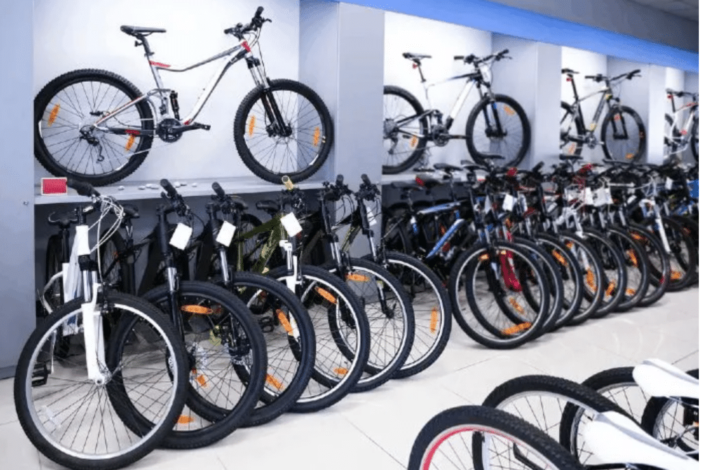

# Bike-Sales-Analysis

## Introduction

This project provides a detailed analysis of a bike store's sales performance and customer demographics. Through data visualization, key factors influencing bike purchases, including income, gender, region, education, and commuting distance, are explored.

The interactive dashboard allows users to delve into various aspects of the data, offering valuable insights to inform sales strategies and marketing efforts. By understanding the customer base and their purchasing behaviors, the project aims to enhance business operations and better meet customer needs.

## Data Source
The dataset used for this analysis was from Kaggle [here](https://github.com/AlexTheAnalyst/Exc...)

