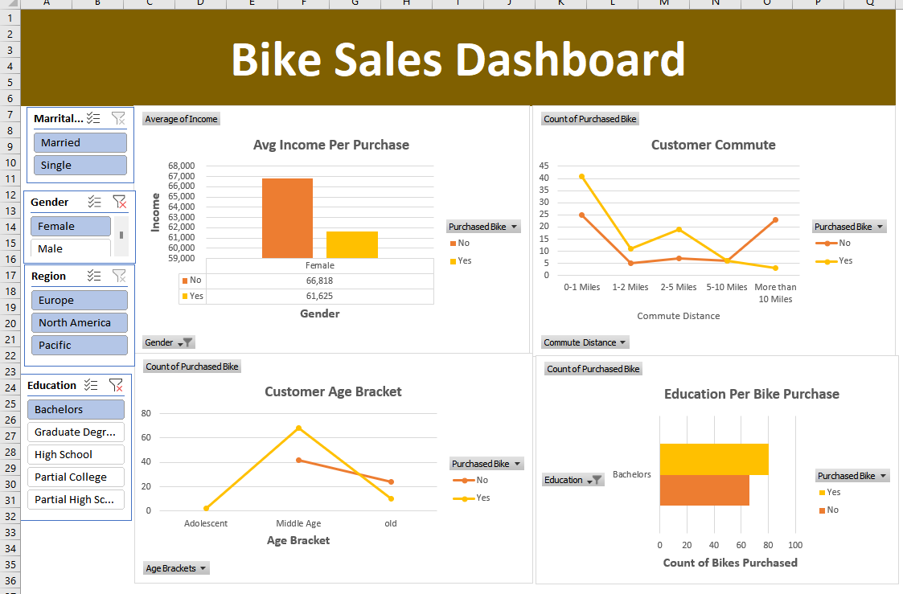

# Bike-Sales-Analysis

## Introduction

This project provides a detailed analysis of a bike store's sales performance and customer demographics. Through data visualization, key factors influencing bike purchases, including income, gender, region, education, and commuting distance, are explored.

The interactive dashboard allows users to delve into various aspects of the data, offering valuable insights to inform sales strategies and marketing efforts. By understanding the customer base and their purchasing behaviors, the project aims to enhance business operations and better meet customer needs.

## Data Source
The dataset used for this analysis was from Kaggle [here](https://github.com/AlexTheAnalyst/Exc...)

## Problem Statement
1. How does the average income of customers influence their decision to purchase a bike, and how does this vary by gender?
2. What is the relationship between the distance customers commute and their likelihood of purchasing a bike?
3. How does the age of customers affect their bike purchasing decisions, and what are the trends across different age brackets?
4. How does the education level of customers correlate with their likelihood of purchasing a bike?
5. How do bike purchasing patterns vary across different regions, and what regional factors contribute to these differences?
6. How does the marital status of customers influence their decision to purchase a bike?
7. How do promotional activities and discounts affect bike sales, and which promotions are most effective in driving purchases?
8. How does the average income differ between males and females who purchase bikes versus those who do not?
9.  What is the relationship between commute distance and the likelihood of purchasing a bike?
10. How does the age bracket of customers influence their decision to purchase a bike?
11. How does the education level of customers correlate with bike purchases?

## Tools Used
- Microsoft Excel (used for data cleaning and analysis)
- Pivot Table

## Data Cleaning /Preparation.
In the cleaning phase, the following task was performed:

- Removed dublicate.
- Filling up M,S,F and M with Married,Single,Female and Male, and using find and replace.
- Creating a new column and categorizing the age into “Adolescent”,Middle Age”, and “Old” using the nested IF statement.
- Building Pivot table with the cleaned data.(pivot table is how you actually help build your Dashboard to help build your visualizations)
Building a dashboard.

## Exploratory Data Analysis.
- Finding the average income of someone that did not buy a bike.
- Finding the income change after they bought a bike or whether they didn’t buy a bike.

## Data Analysis
Include some interesting formula,

 =IF(L2>54,"Old",(IF(L2>=31,"Middle Age",IF(L2<31,"Adolescent","Invalid"))))
 
 ## Data Visualization
 
 
## Conclusion and Recommendations
### Conclusion
- Sales vary significantly by region and season, with certain periods showing higher demand.
- Customers' commuting distance plays a significant role in their decision to purchase a bike.
- Higher education levels correlate with an increased likelihood of purchasing a bike.
- Different regions exhibit unique purchasing patterns influenced by local factors.
- Marital status impacts bike purchasing decisions, with trends varying among different groups.
- Promotional activities and discounts have a notable impact on bike sales, with specific promotions driving higher purchases.

### Recommendations
- Develop marketing campaigns focused on the primary customer demographics identified, such as specific age groups and income brackets.
- Adjust inventory levels to align with peak sales periods and regional demand to ensure sufficient stock during high-demand times.
- Focus on stocking bike models that are popular among customers with higher education levels and longer commuting distances.
- Implement targeted promotions during peak sales periods and for specific customer segments to maximize effectiveness.
- Improve in-store and online customer experiences by addressing feedback and streamlining the purchasing process.
- Offer personalized recommendations and support to enhance customer satisfaction and loyalty.
- Develop region-specific marketing strategies to address unique local factors and purchasing patterns.
- Collaborate with local organizations and events to increase brand visibility and engagement.

## Results/Finding
The Analysis results are summarized as follows;

- Married people are making alot more on average.
- People with Bachalor degrees on average are making close to 60,000.
- For the gender, Male tend to buy more bikes than Female.

## Reference
[Alextheanalyst](https://github.com/AlexTheAnalyst/Excel-Tutorial/blob/main/Excel%20Project%20Dataset.xlsx)

